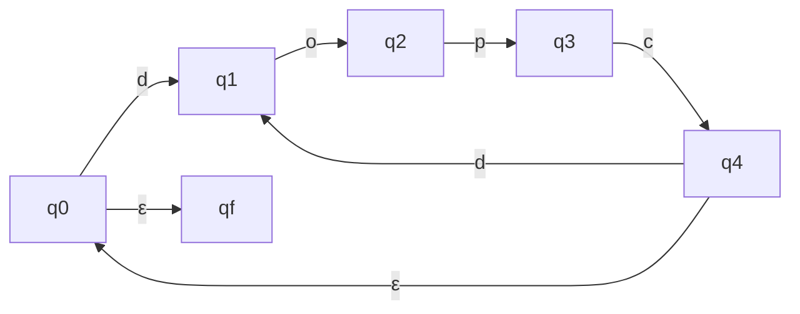

# Simulasi Pintu Otomatis — PDA + Mesin Turing

> Projek UAS Teori Bahasa dan Automata.
> Pintu otomatis yang pinter, bukan cuma buka tutup doang.

---

## Daftar Isi

- [Apa Isinya?](#apa-isinya)
- [Cara Jalanin](#cara-jalanin)
- [PDA — Pushdown Automata](#pda--pushdown-automata)
- [Mesin Turing + GUI](#mesin-turing--gui)
- [Struktur Folder](#struktur-folder)

---

## Apa Isinya?

| Bagian | Bahasa | Cara Main |
|--------|--------|-----------|
| **PDA** | `(dopc)+` | Ketik string, dicek automata |
| **Mesin Turing** | `(dopc)+` | Deteksi orang lewat kamera → simbol → dicek Turing Machine |

Simbol-simbol sakti:

| Simbol | Artinya |
|--------|---------|
| d | Sensor nyium orang |
| o | Pintu menguap (terbuka) |
| p | Orang lewat |
| c | Pintu tutup lagi |
| X | Udah diproses (cap keren) |
| B | Blank, ujung tape |

String keren: `dopc` → diterima. String norak: `docp` → ditolak.

---

## Cara Jalanin

### 1. Siapin dulu

```bash
pip install opencv-python
```

### 2. PDA (terminal aja)

```bash
python pda/pda.py
```

Tinggal ketik string, misal `dopcdopc`, terus enter. Nanti keluar trace-nya.

### 3. Mesin Turing (pake kamera + GUI)

```bash
python turing/main.py
```

Ntar muncul jendela keren dengan:
- Kamera langsung (nyium orang pake HOG + face detection)
- Status pintu (lagi buka/tutup/menunggu)
- Tape + head position
- State machine yang colap-colaper实时
- Log sistem (ngeliatin semua yang terjadi)

---

## PDA — Pushdown Automata

ADA DI: `pda/pda.py`

Buat apa? Ngecek apakah input string sesuai pola `(dopc)+`.

### States



Stack-nya Z aja (gak dipake push/pop — ini PDA cupu, kerja pake state doang).

### Cara kerja

1. Masukin string (contoh: `dopc`)
2. Program jalanin step-by-step
3. Kalo sampe `qf` → DITERIMA
4. Kalo mentok gak ada transisi → DITOLAK

---

## Mesin Turing + GUI

ADA DI: `turing/`

Ini yang lebih canggih. Bukan cuma teori doang — pake kamera beneran.

### Cara kerja (dari awal sampe akhir)

```
Orang lewat depan kamera
    ↓
Sensor deteksi (d)
    ↓
Pintu buka (o)
    ↓
Orang lewat (p)
    ↓
Pintu tutup (c)
    ↓
String "dopc" dikirim ke Turing Machine
    ↓
Turing ngecek step-by-step
    ↓
Kalo bener → DITERIMA ✅
Kalo salah → DITOLAK ❌
```

### Transisi Turing Machine

| State | Baca | Tulis | Gerak | Ke |
|-------|------|-------|-------|----|
| q0 | d | X | Kanan | q1 |
| q1 | o | X | Kanan | q2 |
| q2 | p | X | Kanan | q3 |
| q3 | c | X | Kanan | q4 |
| q4 | d | X | Kanan | q1 |
| q4 | B | B | Diam | qaccept |
| any | lainnya | - | - | qreject |

---

## Struktur Folder

```
automataUAS/
├── pda/
│   └── pda.py           # Pushdown Automata (terminal)
│
├── turing/
│   ├── main.py           # entry point GUI
│   ├── gui.py            # UI pake tkinter
│   ├── turing_machine.py # class Turing Machine
│   └── camera_detector.py # deteksi orang pake OpenCV
│
├── requirements.txt      # oplec
├── .gitignore            # biar rapi
└── README.md             # ini loh
```

---

Dibuat dengan ❤️ (dan sedikit 🤯) buat UAS Teori Bahasa dan Automata.
